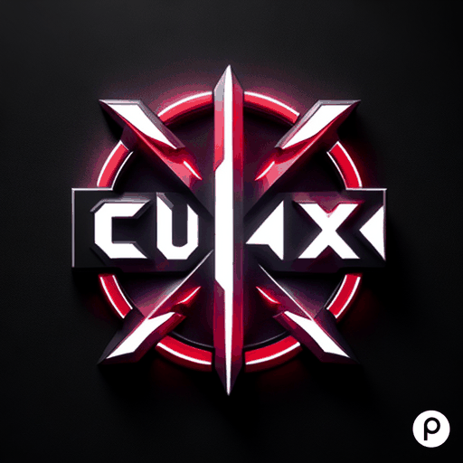

<p align="center">
  
</p>

[](LICENSE)
[](https://github.com/Rohan-Muslekar/crux/releases)
[](https://codecov.io/gh/Rohan-Muslekar/crux)

# CRUX - C++ Rules Engine for eXecution



CRUX is a powerful C++ rules engine designed for efficient rule evaluation and decision-making processes. It provides a flexible and scalable framework to define and execute rules based on specific conditions.

## Features

### Intuitive Rule Definition

Define rules using a structured and easy-to-understand syntax. The syntax supports various conditions, operators, and events, allowing you to express complex logic with clarity.

### Flexible Condition Evaluation

CRUX supports a wide range of condition types, including nested conditions and complex expressions. You can use logical operators (AND, OR, NOT) to create intricate conditions that match your specific use cases.

### Event Handling

Define custom events that trigger based on the outcomes of rule evaluations. Events provide a mechanism for your application to react dynamically to changes and decisions made by the rules engine.

### Prioritization

Prioritize rules based on user-defined priorities. Higher-priority rules are evaluated first, allowing you to control the order of rule execution and ensure critical rules are processed promptly.

### Dynamic Rule Updates

CRUX supports dynamic updates to rules during runtime. You can add, update, or remove rules on the fly, enabling your application to adapt to changing conditions and requirements without restarting.

### Rule Chaining

Rule chaining allows you to link multiple rules together in a sequence, forming a chain of rules to be evaluated. This enables you to create more complex decision-making processes by breaking them down into smaller, manageable rules.

### Example Rule Chaining

```cpp
// Define Rule 1
Rule rule1 = ...;

// Define Rule 2
Rule rule2 = ...;

// Chain Rule 1 and Rule 2
rule1.chain(rule2);

// Add the chained rule to the CRUX engine
cruxEngine.addRule(rule1);
```

In this example, `rule1` will be evaluated first, and if it succeeds, `rule2` will be evaluated next. This allows you to create sequential logic based on the outcomes of each rule in the chain.

## Getting Started

### Installation

Clone the repository:

```bash
git clone https://github.com/Rohan-Muslekar/CruX.git
cd CruX
```

Build the project:

```bash
make
```

### Usage

1. Define your rules using the provided syntax.
2. Integrate CRUX into your C++ project.
3. Execute the rules engine and observe the events triggered based on rule evaluation.


## Examples

### Basic Rule

```cpp
#include "crux.h"

int main() {
    // Initialize CRUX engine

    // Define rules

    // Execute the rules engine

    return 0;
}
```

## Contributing

Contributions are welcome! Feel free to open issues, submit pull requests, or suggest new features.

## License

This project is licensed under the MIT License - see the [LICENSE](LICENSE) file for details.